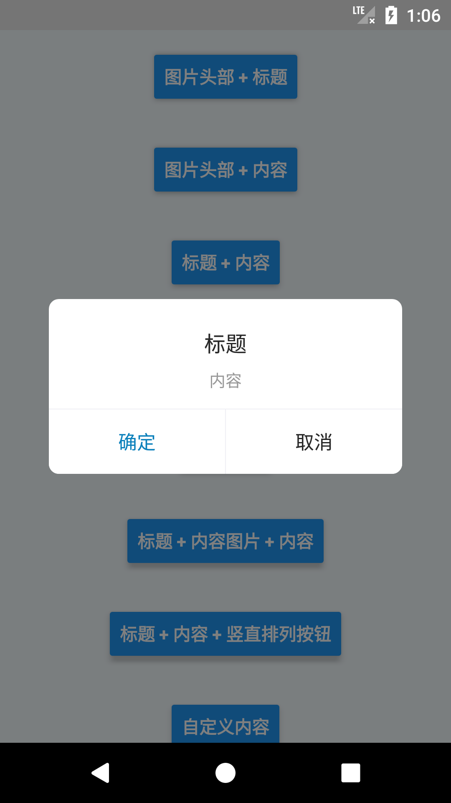

# react-native-custom-dialog
React Native 自定义Dialog组件

### 组件样式

| Dialog类别 | iOS | Android |
| --- | --- | ---|
| 图片头部 + 标题 |  |  |
| 图片头部 + 内容 |  |  |
| 标题 + 内容 |  |  |
| 只有标题 |  |  |
| 只有内容 |  |  |
| 标题 + 内容图片 + 内容 |  |  |
| 标题 + 内容 + 竖直排列按钮 |  |  |
| 自定义内容 |  |  |

### 组件用法

1. 安装组件

```bash
npm i react-native-custom-dialog --save
```
    
2. 引入组件

```javascript
import React, {Component} from 'react';
import CustomDialog from 'react-native-custom-dialog';
//...
export default class index extends Component {
  render() {
    return (
      <CustomDialog ref={customDialog => {this.customDialog = customDialog}}/>
    )
  }
}
```

3. 显示组件

```javascript
this.customDialog.show({
   headerImg: require('顶部区域图片uri'),
   title: "标题",
   content: "内容",
   actions: [
       {name: "确定", func: () => {global.toast("确定") }, style: {color: "#0b80bb"}},
       {name: "取消"},
   ], // 按钮
   horizontal: true/false, // 按钮是否水平排列
   cancelable: true/false, // 是否可取消
   contentImg: require('内容区域图片uri'),
   contentStretch: true/false, // 内容区域是否可延展
   contentStyle: {}, // 内容区域包裹样式
   titleStyle: {}, // 标题区域包裹样式
})
```

### 组件方法
- 显示

```javascript
show(option)
```

- 隐藏

```javascript
hide()
```

- 重置

```javascript
reset()
```

### 注意点
- 该组件使用自带的Model，自带一定的zIndex，使用时注意层级变换。
- 在同一界面时，由于使用同一个组件对象，若显示不同的Dialog（如：A显示title、B不显示title），则需要在 `show()` 之前先重置，调用 `reset()`。